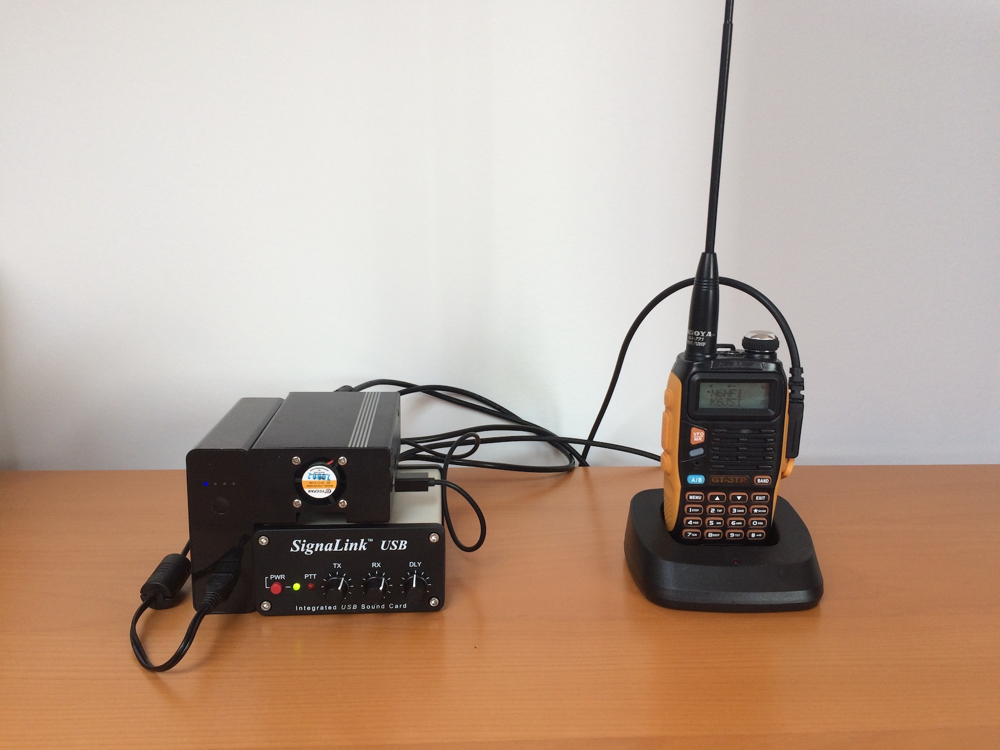

# W6BSD-R

W6BSD-R: EchoLink Node installation and configuration for N6NFI repeater.

## The Vault:

The vault file contains all the private information. Here is how the
fault file should be structured.

```
---

# Accouns are shell accounts that will be created on the raspberry pi
# (admin accounts)
accounts:
  - name: <login>
    gcos: <First and last name>
    password: <hash of the password>

node:
  callsign: <your call sign echolink>
  password: <echolink password>
  lon: 122.25.21W
  lat: 37.49.35N
```

## EchoLink node running.



The node components are:
- Raspberry Pi 3
- The SignaLink sound card connected to the radio
- Baofeng GT-3TP Radio
- Battery pack for when the power goes down
